# Form Fields Design System Study [Draft]

## Background

Form fields are fundamental UI components that present unique challenges in creating a unified system.
We need to find the perfect balance by making things standard while keeping them flexible and easy to use.

### Technical Complexity

- Multiple interaction states (filled, focus, read-only, error, pending, valid...)
- Responsive behavior across different viewport sizes and device types.
- Consistent error and validation feedback
- Unified keyboard navigation patterns
- Accessiblity (non high-priority)

### Design Requirements

- Consistent theme, alignment and spacing patterns across all field types
- Clear design hierarchy for labels, inputs, and helper text
- Multiple representation options for identical data types. (possible config customization)
- Client-specific design needs (not high-priority)

### Customization

- Flexible theming system
- Configurable validation rules
- Extensible component architecture
- Clear documentation for custom implementations

### Legacy

- Existing `Blue-shark` components require review and deprecation
- Current implementation does not follow best practices

*Note: Legacy `Blue-shark` components should be moved to a dedicated legacy folder pending comprehensive review.
These components should not be used as reference for new development without careful evaluation.*

### Primary Objective

Create a simple form fields system that addresses **90-95%** of common use cases while maintaining high customizability.

## Implementation Strategy

### Phase 1: Review & Analysis

- Gather needs & requirements
- Audit existing `Blue-shark` components
- Document and list candidate form fields
- Identify difficulty and limitations

### Phase 2: Architecture & Foundation

- Design extensible component architecture
- Implement core form validation system
- Build base field components
- Create theming and styling system

### Phase 3: Development & Iteration

- Develop high-priority form field types
- Implement error handling and validation feedback
- Documentation

## Review & Analysis

### A. Core Field Elements

1. Label (should be always visible)
   - Clear, concise text
   - Optional required marker (`*`)
   - Support for tooltip/help icon

2. Control/Input Area
   - Clear visual boundaries
   - Consistent height and padding
   - State indicators (focus, error, disabled, sucess?)
   - Optional placeholder

3. Support
   - Helper or error message (when applicable)
   - Character counter (when applicable)
   - Validation indicators (when applicable)
   - Clear/Reset button (when applicable)

### B. Interaction States

#### Illustration

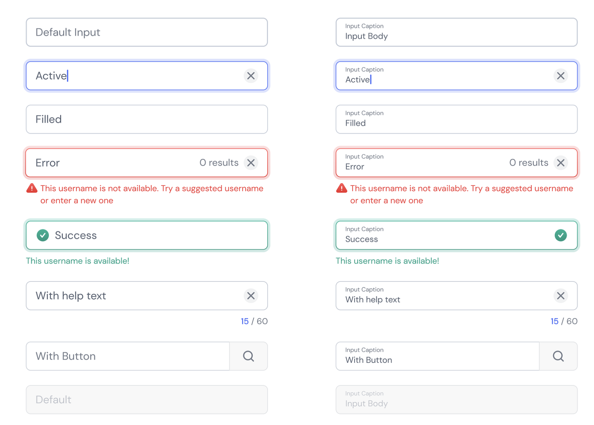

1. Default
   - Neutral background
   - Optional Placeholder

2. Focus
   - Prominent highlight
   - Enhanced contrast
   - Clear focus indicator for accessibility

3. Error
   - Optional Error message
   - Visual error indicators
   - Optional help actions

4. Disabled
   - Reduced opacity
   - No interaction possible

5. Read-only
   - Distinct from disabled and default
   - No interaction possible

6. Pending
   - Spinning loader icon
   - Disabled input with reduced opacity (when applicable)
   - Helper text indicating loading status (when applicable)
   - Maintains consistent field dimensions during loading

7. Filled
    - Clear visual indication of completed (higher contrast)
    - Optional "clear" action to remove content

8. Success/Valid
    - Green or positive color indication
    - Optional success icon/checkmark
    - Optional success message

### C. Validation/Formatting

1. Input Validation
   - Validation on Blur, or on type or Real-time validation (when applicable)
   - Clear error messages
   - Help suggestions (when applicable)
   - Custom validation rules support (Validators)

2. Format Handling
   - Custom formatters (Converters)
   - Internationalization and localization support

### D. Layout Customization

#### Override default styles

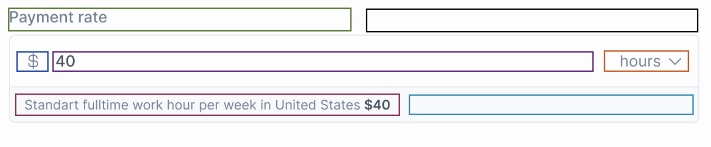

1. CSS Variables
   - Colors
   - Typography
   - Spacing
   - Border radius
   - Shadows
   - Variants...

2. Component Injection
   - Control Component
   - Custom icons or Prefix/Suffix Component injection
   - Custom header
   - Custom footer

#### Override default behaviors

1. Event Handlers (hello `action`...)
   - onChange
   - onFocus
   - onBlur
   - onKeyPress
   - Custom events...

2. Validation Rules
   - Built-in validators
   - Custom validation
   - Async validation
   - Cross-field validation
   - Debounced validation

3. Formatting Rules
   - Built-in Formatters
   - Custom Formatters
   - Async Formatting
   - Debounced Formatting

### E. Keyboard Navigation

1. Basic Navigation
   - Tab: Focus next field
   - Shift + Tab: Focus previous field
   - Enter: Submit (if last field)

2. Advanced Navigation
   - Arrow keys for select fields
   - Spacebar for checkboxes/radio/select fields
   - Custom keyboard shortcuts...

### F. Best Practices

1. Field Width
   - Match expected content length
   - Responsive considerations
   - Min/max width constraints

2. Placeholder Usage
   - Supplementary information only
   - Never for critical instructions
   - Clear visual distinction

3. Required Fields
   - Clear visual indicators
   - Consistent marking system
   - Explicit labeling

4. Error Handling
   - Clear error states
   - Actionable messages
   - Recovery guidance

## Candidate Form Field Types

### Text Fields

### Single Line Text

A basic text input field for collecting short text data, like names...

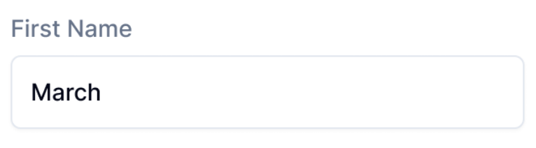

Computing mod: :white_check_mark:

### Multi Line Text (Textarea)

For longer text content like comments, descriptions, messages...

Computing mod: :white_check_mark:

### Password

Masked text input for secure information, like passwords, API keys...

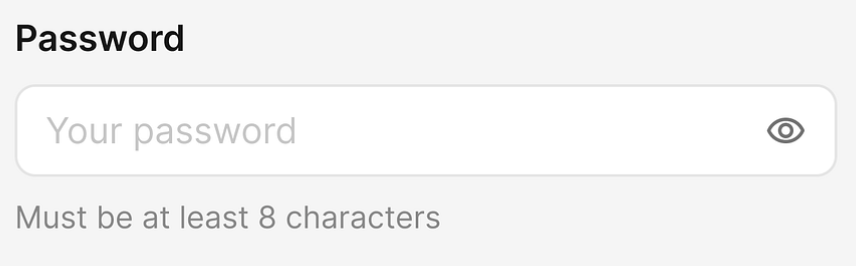

Computing mod: :white_check_mark:

### Email

Text field optimized for email address entry

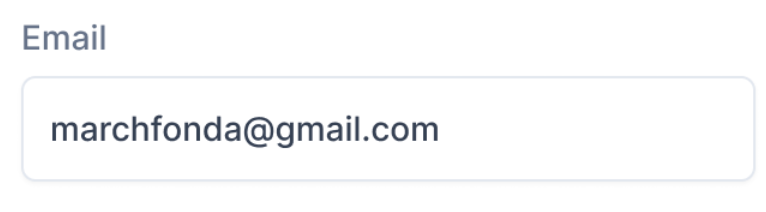

Computing mod: :x:

### Phone Number

Text field formatted for phone numbers

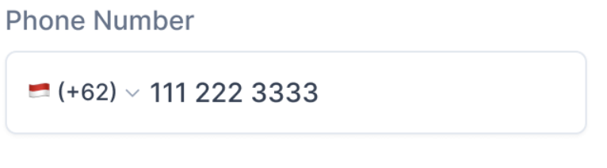

Computing mod: :x:

### URL

Text field for web addresses

Computing mod: :x:

## Numeric Fields

### Number Input

For any numerical values with optional increment/decrement buttons

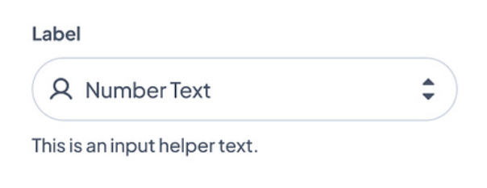

Computing mod: :white_check_mark:

### Slider

Visual control for selecting a number from a range

Computing mod: :x:

### Range Slider

A slider for selecting a minimum and maximum value number from a range

Computing mod: :x:

## Selection Fields

### Select

List of options where one can be selected

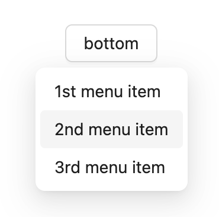

Computing mod: :white_check_mark:

### Multi Select

List where multiple options can be selected

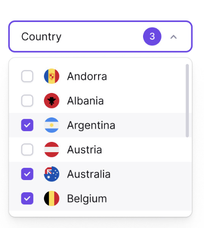
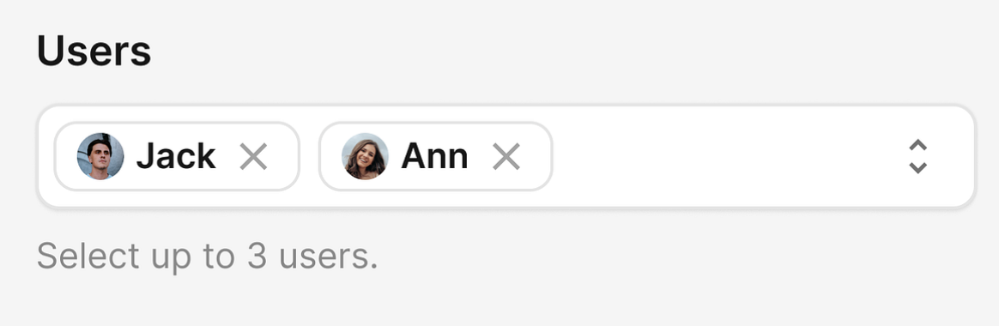

Computing mod: :white_check_mark:

### Radio Select

Group of options where only one can be selected

Computing mod: :white_check_mark:

### Checkboxes

Group of options where multiple can be selected

Computing mod: :white_check_mark:

### Toggle Switch

On/off or true/false selection

Computing mod: :white_check_mark:

## Date and Time Fields

### Date Picker

Calendar interface for selecting dates

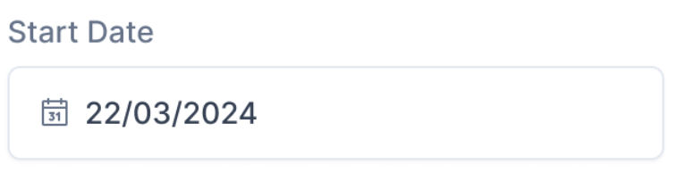

Computing mod: :white_check_mark:

### Time Picker

For selecting specific times

Computing mod: :x:

### Date and Time Picker

Combines both date and time selection

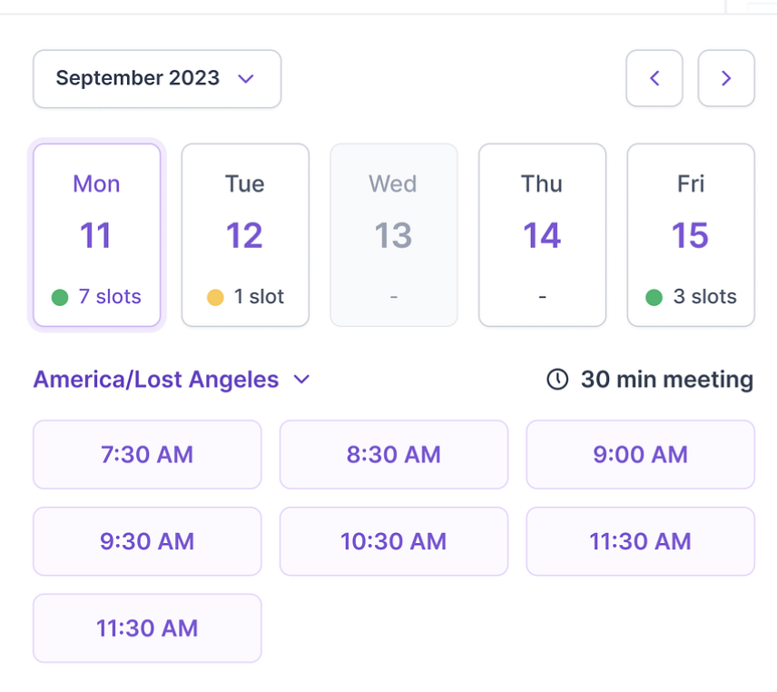

Computing mod: :x:

### Month - Week Selector

For choosing day, weeks, month and year...

Computing mod: :white_check_mark:

## Special Purpose Fields

### Color Picker

Visual interface for selecting colors

Computing mod: :white_check_mark:

### File Upload

For selecting and uploading file

Computing mod: :white_check_mark:

### Multi File Upload

For selecting and uploading files

Computing mod: :x:

### Auto-complete

Text field with suggested completion options

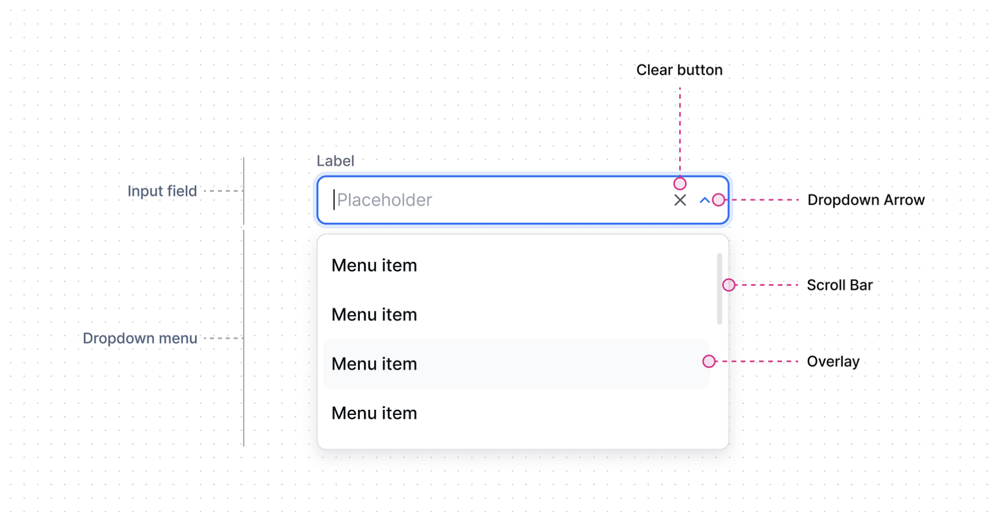

Computing mod: :x:

### Rich Text Editor

Advanced text editor with formatting options

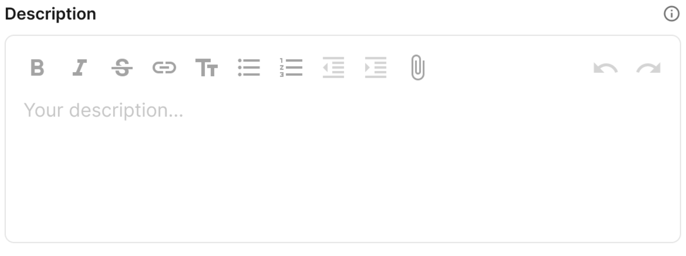

Computing mod: :x:

## Currrent limitations

### Mod

- We can't rely on the existing NumberValidator, because this validator has its allowFloat property set to false it will still allow decimal numbers.
It will parse it as an Integer and validates it, but it should probably throw an error instead.

- TextInput `action` event that is raised multiple times.

- Missing overlay auto-placement mechanism when it exceeds viewport boundaries. (Behavior required for dropdowns)
